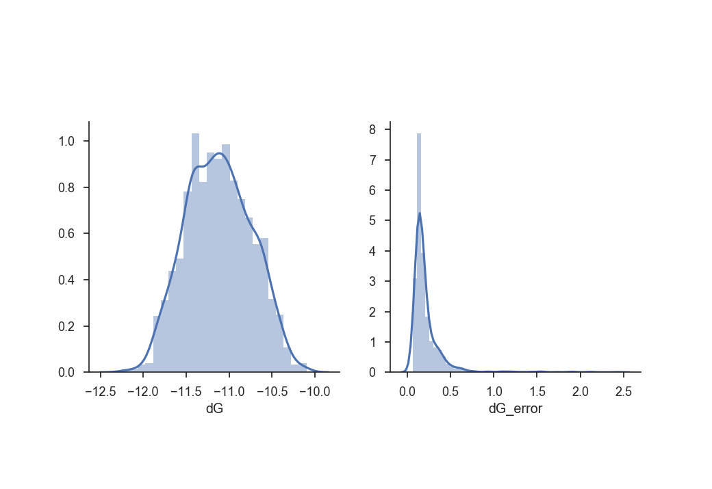
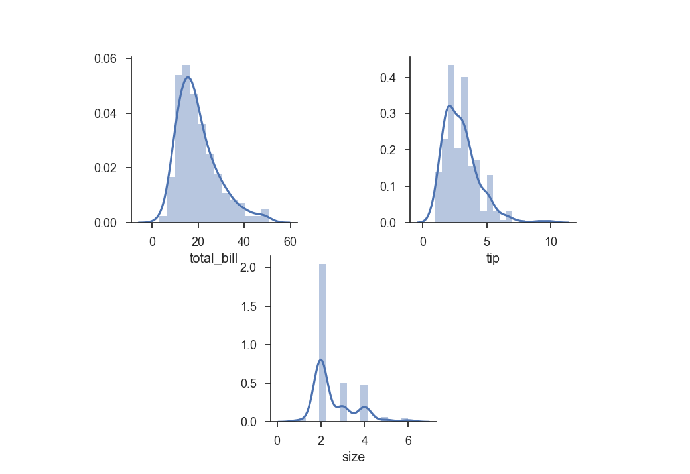

Plot.py examples
----------------
plot.py  -csv data/helical_variation_final.csv -t distall  -o imgs/examples/0.png 
basic distplot test
plot.py  -csv data/tips.csv -t distall  -o imgs/examples/1.png 
basic distplot test
